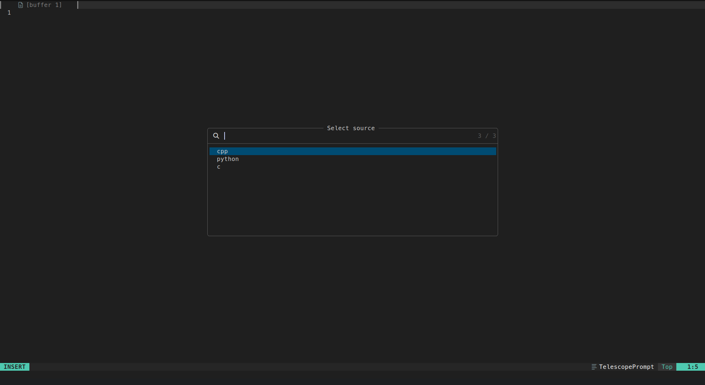
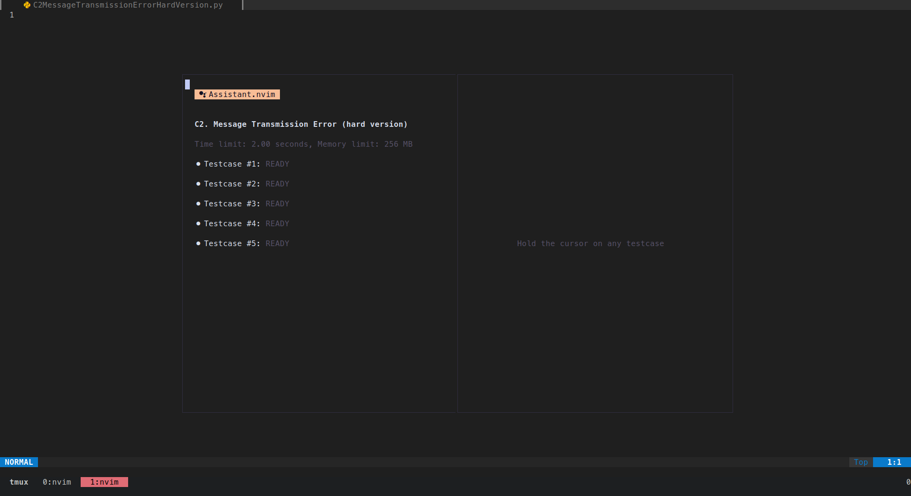
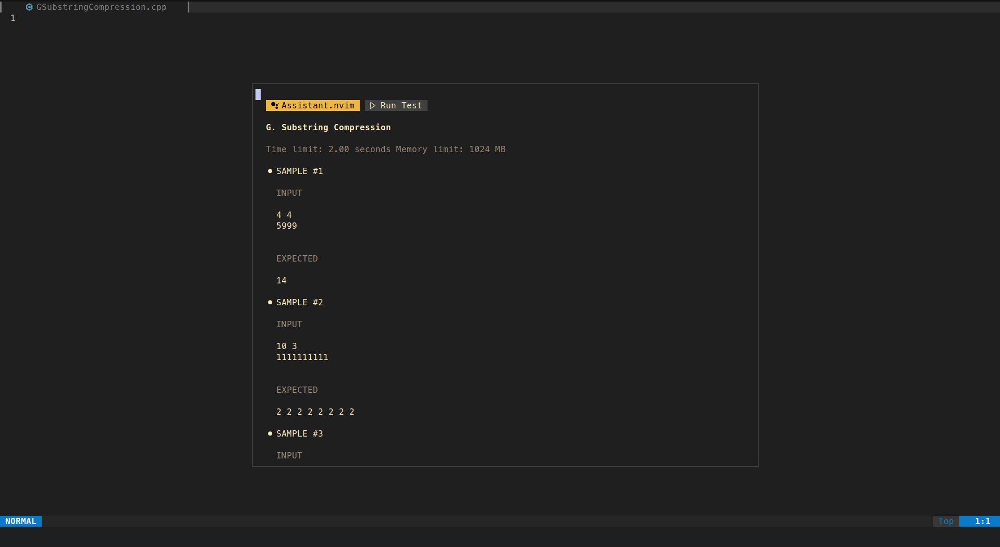

# **Assistant.nvim**

A simple and powerful neovim plugin for testing sample data for competitive programming platforms which build top of a world wide used browser extension **[Competitive Companion](https://github.com/jmerle/competitive-companion)**





<br />

# **Features**

- Blazingly fast.
- Highly customizable.
- Supports both environment and custom themes.
- Easy to use.

<br />

> One important factor in competitive programming is Speed, make sure you don't compromise with that, while you using some fancy plugin or software.

<br />

# **Requirements**

- **Neovim** >= 9.5
- [Competitive companion Browser extension](https://github.com/jmerle/competitive-companion)

<br />

# **Setup with [Lazy.nvim](https://github.com/folke/lazy.nvim)**

```lua
-- Example to setup for C++ and Python
{
    "A7lavinraj/assistant.nvim",
    dependencies = { "stevearc/dressing.nvim" },
    opts = {
        commands = {
            python = {
                extension = "py",
                compile = nil,
                execute = {
                    main = "python3",
                    args = { "$FILENAME_WITH_EXTENSION" }
                },
            },
            cpp = {
                extension = "cpp",
                compile = {
                    main = "g++",
                    args = { "$FILENAME_WITH_EXTENSION", "-o", "$FILENAME_WITHOUT_EXTENSION" }
                },
                execute = {
                    main = "./$FILENAME_WITHOUT_EXTENSION",
                    args = nil
                },
            },
        },
        time_limit = 5000,
        border = false -- border is OFF by default
        theme = "dynamic" -- "gruvbox", "catppuccin" and "tokyonight" are also available
    }
}
```

## Explaination of above code snippet

- First line points to github repository from where the plugin is get installed.
- Second line is the dependency array for the plugin, In this case its [Dressing.nvim](https://github.com/stevearc/dressing.nvim)
- Third line contains the options table to customize plugin:

```sh
g++ example.cpp -o example # {main} {arg1} {args2} {arg3}
```

Above code snippet is a command to compile a C++ file, If you take a closure look on the comment right infront of command you can guess `main = g++`, `arg1 = example.cpp`, `arg2 = -o` and `arg3 = example`, So if i want to extend the configuration for `Python`, I just need to add following code snippet to commands table.

```lua
python = {
    extension = "py", -- your prefered file extension for python file
    compile = nil, -- since python code doesn't get compiled so pass a nil
    execute = { -- {main} command and array of {args} as we saw earlier.
        main = "python3",
        args = { "$FILENAME_WITH_EXTENSION" }
    },
},
```

<br />

> key to the new table is **type of file you want to run**. In this case is `python`, you can get the correct filetype of file by just open that file inside neovim and type the following command.

<br />

```lua
:lua print(vim.bo.filetype)
```

- `time_limit` option is used to limit your code execution process to prevent infinite execution.
- `border` option is used to enable borders.
- `theme` option is used to change themes. there are only four options yet `gruvbox`, `catppuccin`, `tokyonight` and `dynamic`. `dynamic` option uses the current environment colorsheme.

<br />

https://github.com/user-attachments/assets/cf62cd9e-8b23-48be-86f5-c5ae24915b63

<br />

In the above video guide you can see every feature that this plugin provides.

- Sample fetching
- Running testcases
- Adding custom testcases

There is only one command to interact with plugin `:AssistantToggle` which toggle the UI window of plugin and rest operations are done by keymappings.

```lua
 -- command to open plugin window
:AssistantToggle

-- prefered keymap for conciseness
vim.keymap.set("n", "<leader>a", "<cmd>AssistantToggle<cr>", { desc = "Assistant window toggle" })
```

| Key   | Operation                                       |
| ----- | ----------------------------------------------- |
| `Tab` | Move between splits                             |
| `Esc` | Close current window                            |
| `q`   | Close current window                            |
| `r`   | Run testcase on which the cursor is holded      |
| `R`   | Run all available testcases                     |
| `c`   | Create an empty testcase                        |
| `d`   | Delete testcase on which the cursor is holded   |
| `i`   | Open prompt window for updating input           |
| `e`   | Open prompt window for updating expected output |
