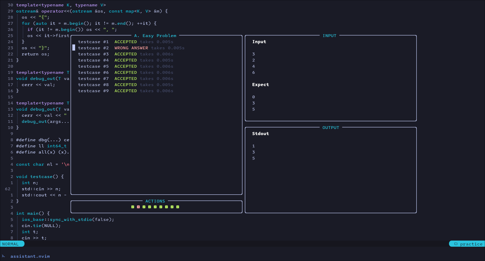

<h1 align="center" style="background: linear-gradient(45deg, #F8BD96, #F28FAD); background-clip: text; color: transparent;">Assistant.nvim</h1>

<div align="center"><p>
    <a href="https://github.com/A7Lavinraj/assistant.nvim/releases/latest">
      
    </a>
    <a href="https://github.com/A7Lavinraj/assistant.nvim/pulse">
      
    </a>
    <a href="https://github.com/A7Lavinraj/assistant.nvim/blob/main/LICENSE">
      
    </a>
    <a href="https://github.com/A7Lavinraj/assistant.nvim/stargazers">
      
    </a>
    <a href="https://github.com/A7Lavinraj/assistant.nvim/issues">
      
    </a>
    <a href="https://github.com/A7Lavinraj/assistant.nvim">
      
    </a>
</div>

<h4 align="center"><span>Assistant.nvim</span> is a neovim plugin which provide various features related to sample data testing in competitive programming scenarios</h4>

<br />



<br />

# **Features**

- :zap: Blazingly fast.
- :unlock: Highly customizable.
- :high_brightness: Supports both environment and custom themes.
- :smiley: Easy to use.

<br />

> One important factor in competitive programming is Speed, make sure you don't compromise with that, while using some fancy plugin or software.

<br />

# **Requirements**

- **Neovim version** >= 9.5
- [Competitive companion Browser extension](https://github.com/jmerle/competitive-companion)

<br />

# **Setup with [Lazy.nvim](https://github.com/folke/lazy.nvim)**

```lua
-- Example to setup for C++ and Python
{
    "A7lavinraj/assistant.nvim",
    dependencies = { "stevearc/dressing.nvim" }, -- optional but recommended
    keys = {
        { "<leader>a", "<cmd>AssistantToggle<cr>", desc = "Toggle Assistant.nvim window" }
    },
    opts = {}
}
```

## Explaination of above code snippet

- First line points to github repository from where the plugin is get installed.
- Second line is the dependency array for the plugin, In this case its [Dressing.nvim](https://github.com/stevearc/dressing.nvim)
- Third line contains the options table to customize plugin:

```sh
g++ example.cpp -o example # {main} {arg1} {args2} {arg3}
```

Above code snippet is a command to compile a C++ file, If you take a closure look on the comment right infront of command you can guess `main = g++`, `arg1 = example.cpp`, `arg2 = -o` and `arg3 = example`, So if i want to extend the configuration for `Python`, I just need to add following code snippet to commands table.

```lua
python = {
    extension = "py", -- your preferred file extension for python file
    compile = nil, -- since python code doesn't get compiled so pass a nil
    execute = { -- {main} command and array of {args} as we saw earlier.
        main = "python3",
        args = { "$FILENAME_WITH_EXTENSION" }
    },
},
```

<br />

> key to the new table is **type of file you want to run**. In this case is `python`, you can get the correct filetype of file by just open that file inside neovim and type the following command.

<br />

```lua
:lua print(vim.bo.filetype)
```

<br />

> There is only one command to interact with plugin <span style="font-weight: bold; color: lightgray;">AssistantToggle</span> which toggle the UI window of plugin and rest operations are done by key-mappings.

<br />

```lua
 -- command to open and close plugin window
:AssistantToggle
```

<br />

| Key     | Operation                                                 |
| ------- | --------------------------------------------------------- |
| `q`     | Close UI                                                  |
| `r`     | Run testcase on which the cursor is holded                |
| `R`     | Run all available testcases                               |
| `c`     | Create an empty testcase                                  |
| `d`     | Delete testcase on which the cursor is holded             |
| `i`     | Open prompt window for updating input                     |
| `<c-l>` | Navigate to available right window otherwise close the UI |
| `<c-k>` | Navigate to available up window otherwise close the UI    |
| `<c-h>` | Navigate to available left window otherwise close the UI  |
| `<c-j>` | Navigate to available down window otherwise close the UI  |
