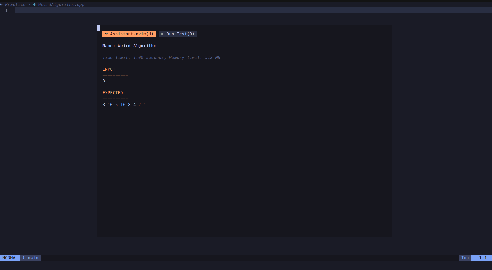
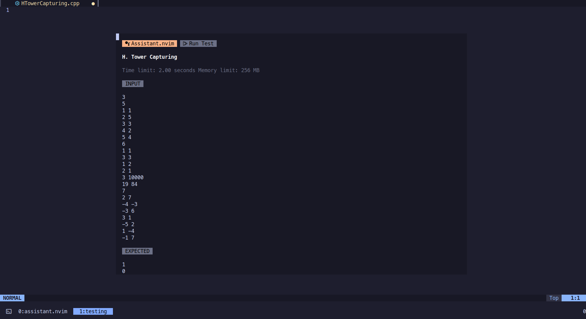

# Assistant.nvim

A light-weight competitive programming code tester.

## Plugin UI

**Home**


**Run Test**


## Plugin in action

https://github.com/A7Lavinraj/assistant.nvim/assets/107323410/2f8ec7d7-2035-42a8-b8e7-e81db469facf

## Setup with [Lazy.nvim](https://github.com/folke/lazy.nvim)

```lua
-- Example to setup for C++ and Python
{
  "A7lavinraj/assistant.nvim",
  dependencies = { "stevearc/dressing.nvim" }
  config = function()
    require("assistant").setup({
	commands = {
	    python = {
		extension = "py",
		compile = nil,
		execute = { main = "python3", args = { "$FILENAME_WITH_EXTENSION" } },
	    },
	    cpp = {
	    extension = "cpp",
		compile = { main = "g++", args = { "$FILENAME_WITH_EXTENSION", "-o", "$FILENAME_WITHOUT_EXTENSION" } },
		execute = { main = "./$FILENAME_WITHOUT_EXTENSION", args = nil },
	    },
	  },
    })
  end
}
```

## Important takeaways

This plugin doesn't show any sources for a problem if they are not setup properly in plugin configuration, look for basic setup mention above. plugin setup function accepts options for configuration:

```lua
{
  commands = {
    python = { -- filetype (look down in the README.md to know how to get filetype of a file)
      extension = "py", -- file extension for source file
      compile = nil, -- nil for non compiled languages
      execute = { main = "python3", args = { "$FILENAME_WITH_EXTENSION" } }, -- execution command
    },
    cpp = {
      extension = "cpp",
      compile = { main = "g++", args = { "$FILENAME_WITH_EXTENSION", "-o", "$FILENAME_WITHOUT_EXTENSION" } }, -- table for compiled languages with contains main and args attributes
      execute = { main = "./$FILENAME_WITHOUT_EXTENSION", args = nil },
    },
  },
}

```

## Command to interact with plugin

`AssistantToggle`: Toggles the plugin UI window

## How to get the filetype of a file in neovim

```vim
:lua print(vim.bo.filetype)
```
